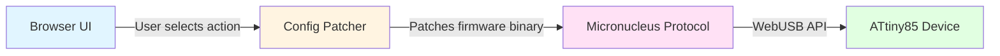

# AdMouse Flasher

[](https://github.com/kevan1/admouse-flasher/actions/workflows/ci.yml)

Browser-based configurator and firmware installer for the single-button AdMouse controller.

**🚀 [Try the live demo →](https://admouse-flasher.vercel.app)**

**Status:** Beta. Tested with an ATtiny85 controller using the Micronucleus bootloader.

<!-- TODO: Add demo GIF showing the configuration and flashing workflow -->

## Requirements

The production site requires desktop Google Chrome or Microsoft Edge because firmware installation uses WebUSB. Safari and Firefox do not currently expose the required API.

## What it does

AdMouse Flasher lets a user select one mouse or keyboard action and install it directly on an AdMouse button. Firmware processing happens locally in the browser: the selected action is written into the firmware image before WebUSB sends it to the controller.

Supported actions include:

- Left, right, middle, and double mouse clicks
- Enter, space, tab, escape, and backspace
- Arrow keys
- Copy and paste shortcuts

## Hardware

- AdMouse single-button controller
- Digispark-compatible ATtiny85
- Button connected to `P0` using `INPUT_PULLUP`
- Micronucleus bootloader with USB ID `16D0:0753`

The controller firmware uses a 50 ms debounce period and supports both keyboard and mouse HID reports through Adafruit TrinketHidCombo.

## User workflow

1. Open the production application in Chrome or Edge.
2. Select a mouse or keyboard action.
3. Disconnect the AdMouse button.
4. Select **Configure my button**.
5. Reconnect the device when the browser requests it.
6. Select the Micronucleus device and wait for the success message.

Do not disconnect the device while firmware is being erased or written.

## Local development

Requirements:

- Node.js 20 or newer
- npm
- A Chromium-based browser with WebUSB

```bash
git clone https://github.com/kevan1/admouse-flasher.git
cd admouse-flasher
npm install
npm run dev
```

Open [http://localhost:3000](http://localhost:3000).

## Available commands

```bash
npm run dev        # Start the local Next.js server
npm run build      # Create a production build
npm run start      # Run the production build
npm run typecheck  # Check TypeScript
npm test           # Run firmware, UI, and protocol tests
```

## Firmware build

The browser serves `public/firmware/admouse-controller.bin`. Regenerate it with:

```bash
./firmware/build.sh
```

The build script installs the Digistump AVR core when needed, downloads the pinned Adafruit Trinket USB source, compiles `firmware/AdMouseController/AdMouseController.ino`, and converts the resulting Intel HEX image to a raw binary.

The firmware contains an `ADM!` configuration block. The web application validates its version and action count, writes the selected action, and updates the checksum before flashing.

## Architecture

The AdMouse Flasher follows a browser-to-device pipeline where firmware patching happens entirely client-side before flashing via WebUSB:



**Components:**

- **Browser UI** (`components/FirmwareFlasher.tsx`): Accessible interface for action selection and device connection
- **Config Patcher** (`lib/firmware-config.ts`): Validates and patches the firmware configuration block with the selected action
- **Micronucleus Protocol** (`lib/micronucleus.ts`): Implements the bootloader communication protocol over WebUSB
- **ATtiny85 Device**: Physical hardware running the Micronucleus bootloader that receives and installs the patched firmware

**Directory structure:**

- `app/`: Next.js application shell and responsive styles
- `components/FirmwareFlasher.tsx`: accessible configuration interface
- `lib/actions.ts`: supported mouse and keyboard actions
- `lib/firmware-config.ts`: firmware configuration patcher
- `lib/micronucleus.ts`: browser-side Micronucleus protocol implementation
- `firmware/`: ATtiny85 source and reproducible build script
- `public/firmware/`: browser-installable firmware image
- `tests/`: firmware patching, UI, and protocol tests
- `docs/specs/`: implementation specification and acceptance criteria

## Browser and deployment notes

- WebUSB requires HTTPS in production; localhost is allowed during development.
- The USB device chooser must be opened from a user interaction.
- Micronucleus remains in programming mode for a short period after connection.
- Close Arduino IDE and other software that may hold the USB device before flashing.
- The application is deployed on Vercel without server-side secrets or environment variables.

## Privacy

Firmware selection and installation happen in the user's browser. The application does not upload device data, action selections, or firmware contents to an application server.

## Third-party software

- [Micronucleus](https://github.com/micronucleus/micronucleus) provides the bootloader and protocol reference.
- [Adafruit Trinket USB](https://github.com/adafruit/Adafruit-Trinket-USB) provides the combined keyboard and mouse HID implementation used by the controller firmware.
- Poppins is distributed under the SIL Open Font License 1.1 included at `app/fonts/OFL.txt`.

Review the corresponding upstream licenses when distributing modified firmware or hardware.

## License

This project is licensed under the [MIT License](LICENSE).
